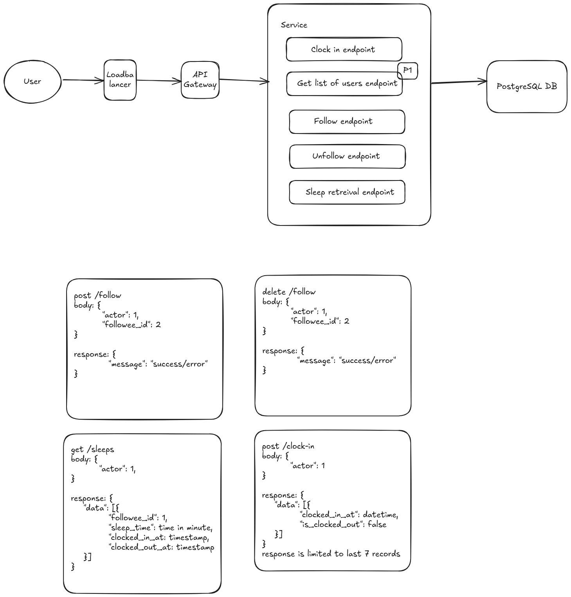
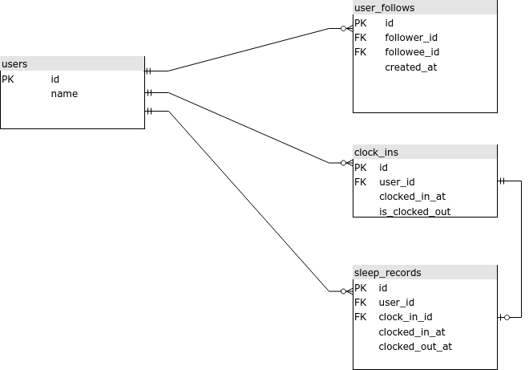

# System Design
This document contains the details of ideas and implementation for time tracker system.

## Functional Requirements
1. **Follow & Unfollow**
      - As a user, I can follow & unfollow other users.
      - P1 features:
        - As a user, I can get list of users.
2. **Clock in**
      - As a user, I can clock in.
      - As a user, I can retreive all clock-ins time ordered by created time.
3. **View sleep records of following users**
      - As a user, I can view all sleep records of my following's users on previous week ordered by sleep length(longest to shortest).

## Non Requirements
- User registration
- User login/authentication
- Get list of users

## Limitation
1. We have not implemented authentication yet, so we are not able to properly check if the user is valid, so for any endpoints implemented, we only define the user as "actor". But for basic needs, we can use like basic auth, store the username and password in database with password being encrypted.
2. We have not implemented get list of users, but this is needed so an actor/follower can properly follow/unfollow a user. But we will check if followee_id does exists in user's table
3. For any clock-ins, every second clock-in will be considered a clock out for the last clock-in for us to calculate sleep record.
4. Since the feature is quite simple, most part is enough with simple error message, but it is better to implement proper logging.
5. Need proper error handling because ActiveModel::Error's full_messages return message with key.
6. Need to implement retry mechanism for concurrent requests to mitigate deadlocks on locking.

## Non-Functional Requirements
1. **Scalability**
      - The system needs to handle high volume of data and high traffic.
      - The system have to support concurrent requests
2. **CAP Theorem**
      - We aim for consistency and availability considering we can give consistent information and no downtime especially in peak time.
      - We achieved consistency by using PostgreSQL's ACID.
      - We achieved availability by using replication.
3. **Performance**
      - p95 100ms

## Business Process

## Schemas
Notes: Sorry that the ERD is a bit mess up, not sure why I can't drag the line to make straight line on draw.io.
